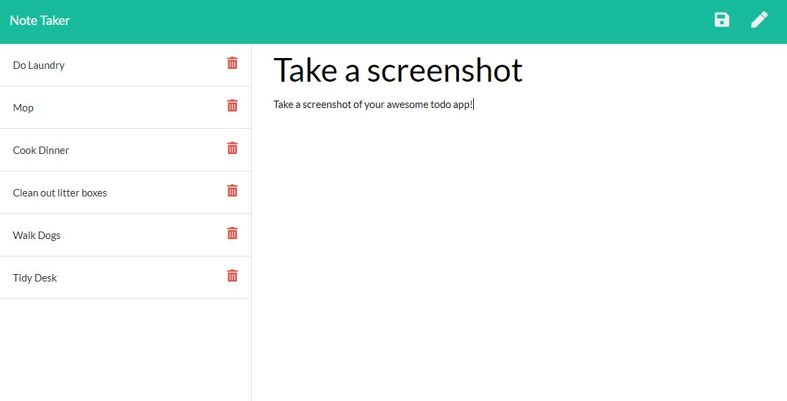

# Note-Taker

## Table of Content
* [ Deployed Site ](#Deployed-Site)
* [ Description ](#Description)
* [ Installation ](#Installation)
* [ Testing ](#Testing)
* [ License ](#License)
* [ Contact Me ](#contact)

## Deployed Site
* https://still-brushlands-74265.herokuapp.com

## Description
* This application allows users to easily store their todo list on a user friendly website. Users can create, save, and delete todo items using a user friendly javascript frontend and an express backend that stores user's todos in a JSON file.

## Installation
* Clone down the repo
* Install npm packages by opening your terminal inside of the application repo and typing 'npm i'
* Open on you local machine by going to localhost:8080!

## Testing
* Open your terminal and enter "npm test". This will run jest. If there are any errors they will be notated, otherwise it will show all of the tests as successful!

## License
* This project is [MIT](https://choosealicense.com/licenses/mit/) licensed. 

## Questions? Contact Me! 
* Github: https://github.com/dianalynshull
* Email: dianalynshull@gmail.com
* Preferred Contact: Email
